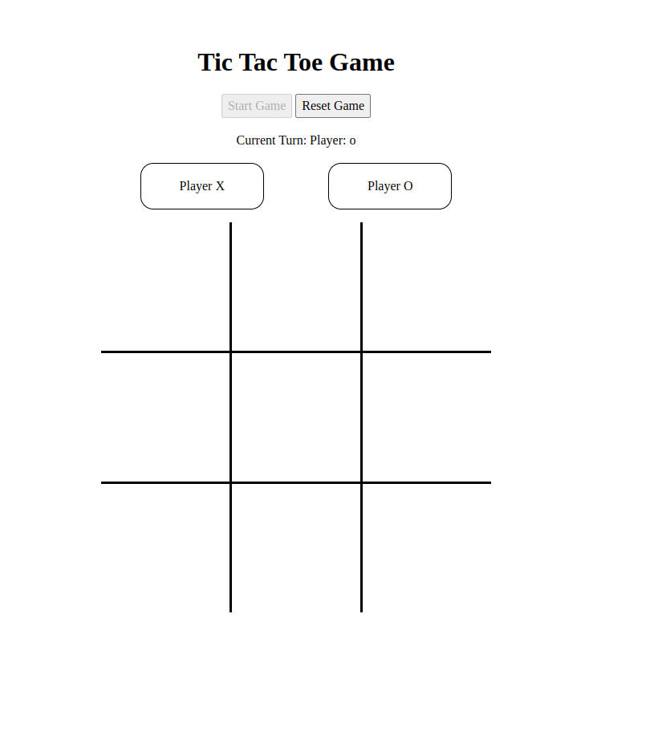

# tic-tac-toe
Basic Tic Tac Toe project for odin project  Javascript course.

## Concepts Learned
- Factory Functions and Module Pattern.
- Variable scope
- IIFE's module pattern
- Made basic SVG's using inkscape
- Closures

## Page screenshot

[Link To Project](https://github.com/joseozuna48/tic-tac-toe)

